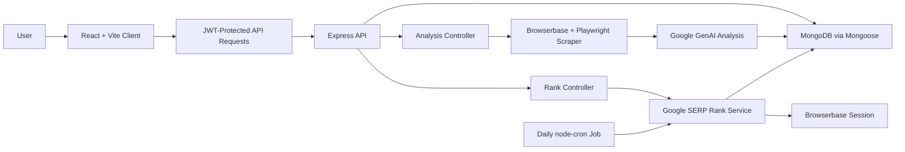

# 📊 RankPilot — AI-Powered SEO Intelligence & Keyword Tracking Platform


Rank Pilot is a full-stack SEO analysis and keyword rank tracking platform. It scans live websites through a cloud browser session, extracts technical SEO signals, uses Gemini to generate structured audit insights, and tracks Google keyword positions over time.

## Features

- AI-assisted SEO audits with overall score, category scores, keywords, issues, and recommendations.
- Rendered-page scraping for metadata, headings, links, images, word count, page size, and load time.
- Protected user accounts with JWT authentication and password hashing.
- Dashboard with recent scans, average score, and quick URL analysis.
- Analysis history with search, status filtering, sorting, pagination, and delete actions.
- Detailed report view with overview, meta tags, content, and issue tabs.
- Google keyword rank tracking for a target domain, including current position, SERP page, best position, position change, competitors, and rank history.
- Manual rank refresh plus scheduled daily rank checks for active tracked keywords.
- Responsive React UI with reusable components, route protection, toast notifications, and dark themed styling.

------------------------------------------------------------------------

## 🌐 Live Demo

https://aarsh-rankpilot.vercel.app/

------------------------------------------------------------------------

## Architecture Overview



------------------------------------------------------------------------

## ✨ Why This Project Stands Out

- Combines browser automation, AI analysis, and SEO intelligence in one platform
- Uses rendered-page crawling instead of relying solely on static HTML analysis
- Generates actionable SEO recommendations using Gemini AI
- Tracks keyword rankings with historical performance data
- Implements asynchronous processing for long-running audits
- Demonstrates full-stack ownership across frontend, backend, database, AI, and browser automation layers 

------------------------------------------------------------------------

## Tech Stack

| Layer | Technologies |
| --- | --- |
| Frontend | React 19, TypeScript, Vite, React Router, Axios, Tailwind CSS, Lucide React |
| Backend | Node.js, Express 5, MongoDB, Mongoose |
| Authentication | JWT, bcrypt |
| AI Analysis | Google GenAI SDK, Gemini/Gemma structured JSON responses |
| Browser Automation | Browserbase, Playwright Core |
| Scheduling | node-cron |
| Deployment | Vercel configuration for client and server |

------------------------------------------------------------------------

## Folder Structure

```text
Rank-Pilot/
|-- client/
|   |-- public/
|   |   `-- favicon.svg
|   |-- src/
|   |   |-- assets/
|   |   |-- components/
|   |   |   `-- home/
|   |   |-- context/
|   |   |-- pages/
|   |   |-- App.tsx
|   |   |-- index.css
|   |   `-- main.tsx
|   |-- package.json
|   |-- vite.config.ts
|   `-- vercel.json
|-- server/
|   |-- config/
|   |-- controllers/
|   |-- cron/
|   |-- middleware/
|   |-- models/
|   |-- routes/
|   |-- services/
|   |-- package.json
|   |-- server.js
|   `-- vercel.json
`-- .gitignore
```

------------------------------------------------------------------------

## Future Improvements

- Add automated tests for API controllers, route protection, and service error paths.
- Add stricter request validation for analysis and rank-tracking payloads.
- Enforce plan limits on the backend instead of only surfacing scan counts in the UI.
- Add exportable PDF/CSV reports for SEO audits and rank history.
- Add email or in-app notifications for rank changes and failed checks.
- Add team/workspace support for shared SEO projects.
- Add observability with structured logging, error tracking, and job monitoring.

------------------------------------------------------------------------

## ⚡ Challenges & Learnings

- Handling long-running SEO analysis workflows without blocking users
- Building reliable browser automation for rendered-page crawling
- Structuring AI-generated SEO responses into predictable formats
- Managing keyword ranking history and trend calculations
- Designing scalable background processing workflows
- Integrating cloud-browser automation with AI-powered analysis
- Optimizing database queries for large audit histories

------------------------------------------------------------------------

